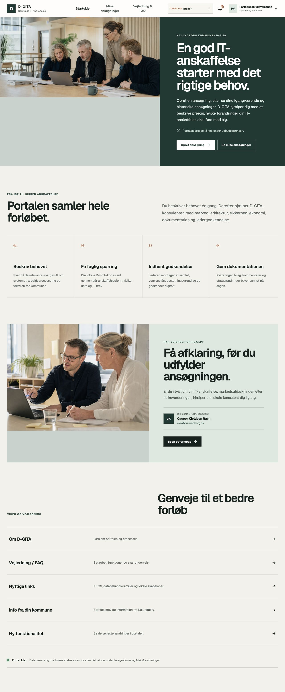
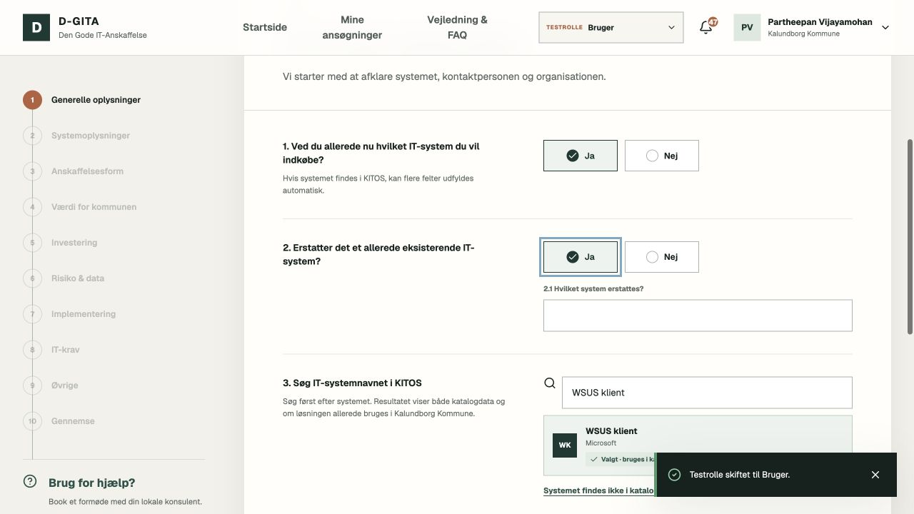
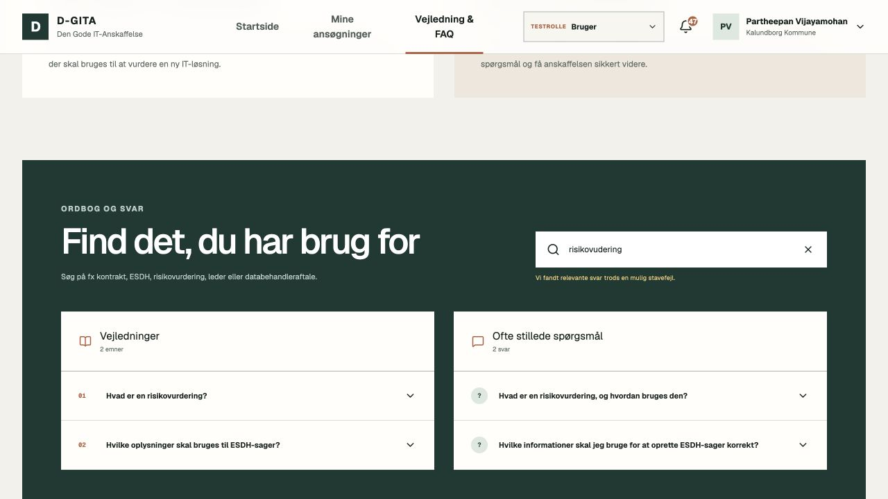
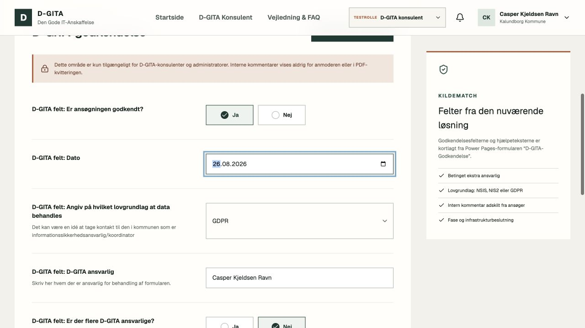
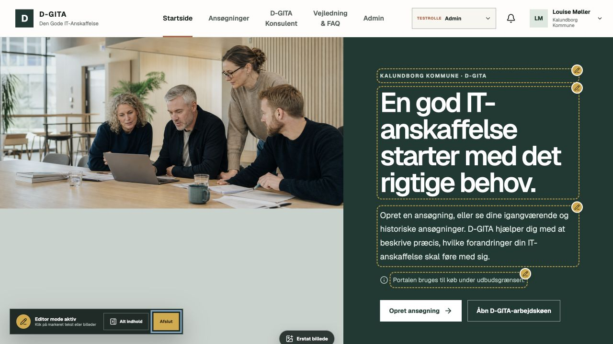
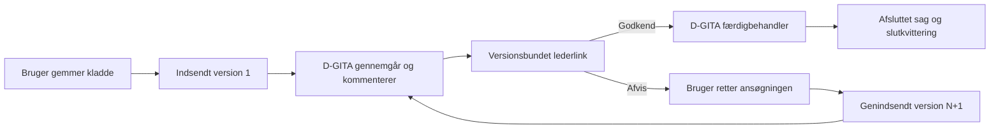
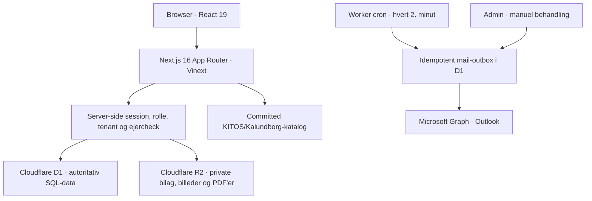

# D-GITA · Den Gode IT-Anskaffelse

En moderne, webbaseret portal til kommunale IT-anskaffelser. Løsningen samler ansøgning, dokumentation, sagsbehandling, ledergodkendelse, Outlook-mail, PDF-kvitteringer og administration i ét responsivt workspace.

Demonstrationssager, roller og personer er test-fixtures. Kontaktoplysninger fra den eksisterende portal er bevaret som redaktionelt demoindhold. Systemkataloget er normaliseret fra de udleverede KITOS- og Kalundborg-regneark og følger med repositoryet som deploybar runtime-data.



## Status

| Område | Status |
| --- | --- |
| Formular, kladder og bilag | Implementeret med D1/R2-persistens |
| Roller og adgangskontrol | Bruger, D-GITA-konsulent og Admin |
| Lederens godkendelsesflow | Versionsbundet link med 7 dages beslutningsfrist og én irreversibel beslutning |
| Rettelse og genindsendelse | Ny låst version N+1 med CAS-konfliktbeskyttelse |
| PDF-kvitteringer | Indsendelse, ledergodkendelse og afslutning |
| Outlook-mail | Graph-adapter og idempotent outbox implementeret; kræver tenant-konfiguration |
| Admin og visuel editor | Redaktionelt indhold, FAQ, links, hjælp og tre billedplaceringer |
| SSO | Sessions- og providergrundlag findes; Entra/FK-loginflow mangler ekstern implementering |
| Primær driftsmodel | Cloudflare Worker/Sites med D1 og R2 |

## Brugeroplevelsen

Formularen består af 10 logiske trin og tilpasser sig brugerens svar. Den indeholder 13 dokumenterede betingelsesregler, fem dokumentflows og en dynamisk gennemgang før indsendelse.

<table>
  <tr>
    <td width="50%"></td>
    <td width="50%"></td>
  </tr>
  <tr>
    <td align="center"><strong>Trinvis ansøgning</strong><br>Betingede spørgsmål, KITOS-opslag, validering og uploads.</td>
    <td align="center"><strong>Vejledning og FAQ</strong><br>Fuzzy-søgning finder relevante svar trods realistiske stavefejl.</td>
  </tr>
</table>

Formularmotoren understøtter blandt andet:

- automatisk visning og skjulning af underspørgsmål
- søgning i 4.656 KITOS-systemer og markering af 420 UUID-matchede Kalundborg-systemer
- lokale aliaser og tidligere systemnavne uden at bruge navne som join-nøgle
- upload af risikovurdering, databehandleraftale, kontrakt, leverandørtjekliste og arkitekturmateriale
- filtype-, MIME- og størrelseskontrol samt SHA-256-registrering; højst 25 MB pr. fil
- dansk beløbsformat, beregnet finansiering og kontrol af implementeringsdatoer
- sikre, brugerejede kladder, automatisk fortsættelse og konfliktbeskyttelse mellem parallelle faner
- versionslåst snapshot og bilagsmanifest ved indsendelse
- rettelse efter afvisning, hvor den tidligere version og kvittering forbliver uforanderlig

## Roller

| Rolle | Adgang og opgaver |
| --- | --- |
| **Bruger** | Opretter ansøgninger, uploader dokumenter, læser kommentarer og ser kun egne sager i egen kommune. Interne D-GITA-felter udleveres aldrig. |
| **D-GITA-konsulent** | Ser kommunens arbejdskø, kommenterer sagen eller konkrete felter, sender til ledergodkendelse og udfylder det interne D-GITA-arbejdsområde. |
| **Admin** | Har konsulentfunktionerne samt administration af redaktionelt indhold, FAQ, links, hjælp, billeder, mailkø og integrationsstatus. |

I det lokale testmiljø kan rollen skiftes i topbaren. Hvert skift opretter en ny servervalideret session; dropdownen er ikke en klient-side sikkerhedsgenvej. I drift skal den erstattes af rolleclaims fra Entra ID eller Fælleskommunal Adgangsstyring.

<table>
  <tr>
    <td width="50%"></td>
    <td width="50%"></td>
  </tr>
  <tr>
    <td align="center"><strong>D-GITA-arbejdsområde</strong><br>Interne vurderinger, feltkommentarer og fase.</td>
    <td align="center"><strong>Visuel editor</strong><br>Markeret redaktionelt indhold og billeder kan redigeres direkte på siden.</td>
  </tr>
</table>

Admin kan redigere registrerede portaltekster, formularhjælp, vejledning, FAQ, links og databehandlerkrav samt erstatte de tre centrale portalbilleder. Tekniske feltnøgler, valideringsregler, statusnavne og navigationslogik er bevidst kodeadministreret, så redaktionelle ændringer ikke kan bryde workflowet.

## Workflow fra ansøgning til afslutning



Vigtige overgange skrives til auditsporet; notifikation og relevant mail oprettes, når workflowet kræver udsendelse. Lederen modtager et versionsbundet beslutningsgrundlag, kan se de relevante bilag og kan kun afgive én irreversibel beslutning inden fristen. Efter beslutningen viser linket alene den registrerede status. Det rå godkendelsestoken gemmes aldrig i databasen.

Kvitteringer genereres som PDF fra den låste version:

- `submission` efter indsendelse
- `approval` efter lederens godkendelse
- `final` ved D-GITA-afslutning

PDF-bytes gemmes privat i R2 med checksum. Mailkøen bruger idempotens, statusserne `queued`, `processing`, `sent`, `failed` og `cancelled` samt højst fem kontrollerede forsøg.

## Arkitektur



Teknologistakken er Next.js 16, React 19, TypeScript 5, Vinext/Vite, Cloudflare Worker, D1, R2, Drizzle og `pdf-lib`. Der findes ingen LocalStorage- eller in-memory-fallback for forretningsdata: manglende D1/R2 får løsningen til at fejle lukket.

Datamodellen dækker tenants, brugere, roller, sessions, ansøgninger, uforanderlige versioner, bilag, indhold, billeder, D-GITA-vurderinger, kommentarer, audit, notifikationer, kvitteringer, mail-outbox og ledergodkendelser. SQL-triggers beskytter indsendte versioner, versionsbundne bilag og auditposter mod ændring.

## Sikkerhedsmodel

- Alle beskyttede portal-API-kald validerer session, rolle, tenant og eventuelt ejer-id på serveren.
- En almindelig bruger kan kun læse ansøgninger, hvor `owner_user_id` matcher den interne bruger, som serveren har opløst fra identity providerens stabile subject.
- Konsulent og Admin er kommuneafgrænset og ser aldrig en anden tenants sager.
- Mutationer kræver samme origin.
- Sessionstoken gemmes hashet i D1; cookien er `HttpOnly`, `SameSite=Lax` og `Secure` på HTTPS og udløber efter 12 timer.
- Offentlige godkendelsessider bruger `no-store`, `noindex`, frame-beskyttelse og `no-referrer`.
- Interne kommentarer og D-GITA-felter findes ikke i brugerens API-projektion eller PDF-kvittering.
- Secrets og Graph access tokens sendes aldrig til browseren.

## Lokal kørsel

Kræver Node.js `>=22.13.0`.

```bash
git clone https://github.com/Parthee-Vijaya/DGITA.git
cd DGITA
npm install
cp .env.example .env.local
npm run dev
```

Åbn derefter [http://localhost:3000](http://localhost:3000). Vinext starter lokal D1 og R2 gennem Miniflare; den ignorerede state gemmes under `.wrangler/`.

### Kør den fulde E2E-test

Start først portalen på testporten:

```bash
npm run dev -- --port 3001
```

Kør derefter i en anden terminal:

```bash
npm run test:e2e
```

## Miljøkonfiguration

Den komplette, secret-frie skabelon findes i [`.env.example`](.env.example).

### Microsoft Graph / Outlook

Følgende variabler kræves for reel mailafsendelse:

```dotenv
DGITA_GRAPH_TENANT_ID=<entra-tenant-guid>
DGITA_GRAPH_CLIENT_ID=<app-registration-guid>
DGITA_GRAPH_CLIENT_SECRET=<secret>
DGITA_GRAPH_SENDER=dgita@kommune.dk
```

Entra-appregistreringen skal have den nødvendige Microsoft Graph application permission til at sende som den godkendte afsenderpostkasse. Adapteren bruger client credentials server-side. Løsningen er lokalt testet med en simuleret Graph-transport, men er ikke valideret mod kommunens live-tenant.

I produktion kræves desuden en stabil `DGITA_APPROVAL_TOKEN_SECRET` på mindst 32 tegn og korrekt `DGITA_APP_ORIGIN`. Disse værdier skal oprettes som platform-secrets og må ikke versionsstyres.

### Entra ID og Fælleskommunal Adgangsstyring

Providerkonfiguration, sessionsmodel og rollemodel er klar til integration. Det eksterne OIDC-login er endnu ikke færdigimplementeret: redirect/callback, JWKS- og tokenvalidering, claim-mapping og automatisk brugerprovisionering skal forbindes til kommunens valgte identity provider.

## Database og migrationer

Bindings er deklareret i `.openai/hosting.json`:

- D1: `DB`
- R2: `FILES`

Drizzle-migrationerne i `drizzle/` er deployment-kilden. Runtime-bootstrap er idempotent og gør en frisk lokal/Sites-database klar uden browserlagring. Buildet pakker migrationsfilerne under `dist/.openai/drizzle`.

Det normaliserede systemkatalog ligger i `features/catalog/data/system-catalog.json` og er committed, så drift ikke afhænger af de lokale Excel-filer.

## Verifikation

```bash
npm run lint
npx tsc --noEmit
npm test
npm run test:e2e
npm audit --omit=dev
```

Den seneste komplette lokale gennemgang består af:

- produktionsbuild gennem Vinext/Vite
- 90 enheds- og integrationstests
- 75 E2E-kontroller af HTTP/API → D1/R2 → PDF/mail-outbox
- SQLite `integrity_check` og `foreign_key_check`
- manuel browsertest af login, roller, ejerskab, formularregler, fuzzy-søgning, D-GITA-felter, admin-editor og tutorial
- 0 kendte sårbarheder i produktionsafhængigheder (`npm audit --omit=dev`)

Et fuldt `npm audit` rapporterer fire moderate, udviklings-only fund i `drizzle-kit`'s transitive, ældre `esbuild`-loader. NPM's foreslåede `--force`-løsning er en breaking nedgradering af migrationsværktøjet; den er derfor ikke anvendt på runtimekoden.

## Deployment

Den funktionelle driftsmodel er Cloudflare Worker/Sites med D1 og R2. Projektet indeholder den nødvendige worker-entry, bindings, cron og migrationspakning, men `.openai/hosting.json` er endnu ikke koblet til et konkret Sites-projekt-id.

Et Vercel-preview er ikke en komplet driftsudgave af denne arkitektur, fordi de forventede `cloudflare:workers`-, D1- og R2-bindings ikke findes dér uden en særskilt persistence-adapter.

## Kendte eksterne grænser

Dette er bevidst ikke fremstillet som færdig kommunal produktion:

- Entra/FK-loginflow og claim-mapping mangler som beskrevet ovenfor.
- Graph kræver kommunens appregistrering, tilladelser, afsenderpostkasse og secrets.
- Uploadflowet har endnu ingen malware-scanner; `scan_status` sættes til `not_configured`.
- Retention- og automatisk slettepolitik er ikke implementeret.
- ESDH-links og journaliseringsflag findes, men automatisk ESDH-arkivering er ikke forbundet.
- KITOS-kataloget er et versioneret snapshot og ikke en live-synkronisering.
- Godkendende ledere er foreløbig tre testidentiteter; i drift skal de komme fra identitets-/organisationsdata.

## Projektstruktur

```text
app/                    Next.js-sider, portal-shell og API-ruter
db/                     D1-schema og runtime-bootstrap
drizzle/                Versionsstyrede SQL-migrationer
features/application/   Formularmotor, kladder, uploads og versionering
features/approval/      Lederlinks, beslutning og versionsbinding
features/case(s)/       Kommentarer, aktivitet, validering og sagsdetaljer
features/mail/          Graph-adapter og idempotent outbox
features/receipt/       PDF-generering og privat lagring
features/workspace/     Roller, adminindhold og sagsprojektioner
features/catalog/       KITOS/Kalundborg-søgning og deploybart katalog
worker/                  Cloudflare Worker og planlagt mailbehandling
tests/                   Render-, kontrakt- og fulde lokale E2E-tests
docs/screenshots/       Verificerede README-screenshots
```

## Datakilder

- `IT Systemkatalog Overblik.xlsx`: 4.656 unikke KITOS-systemer
- `IT Systemer Overblik.xlsx`: 420 Kalundborg-systemer koblet til KITOS via UUID

Kun de felter, som bruges til opslag og visning, er normaliseret til webkataloget. De oprindelige Excel-filer versionsstyres ikke, så unødvendige interne kolonner ikke publiceres.
