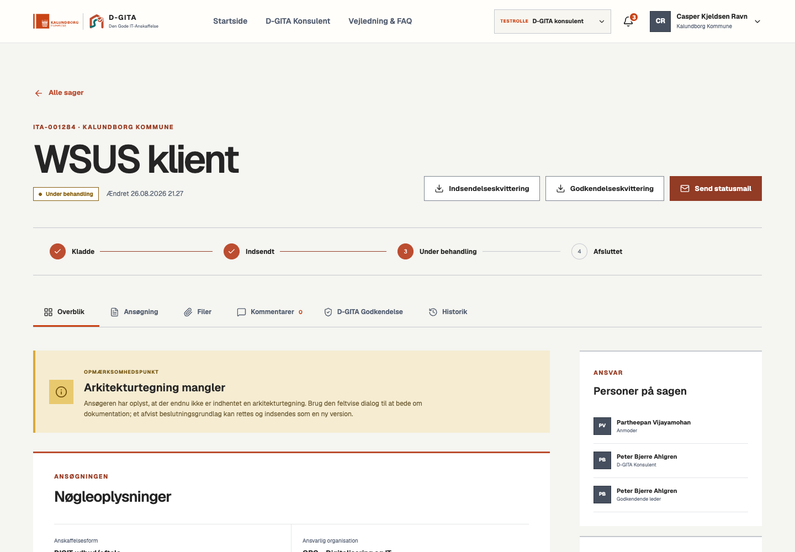

# Robusthedsgennemgang · september 2026

Denne gennemgang dækker kode, adgangsregler, formularmotor, persistens, sagsbehandling, dokumenter, godkendelse, mailkø, administration og centrale browserforløb. Den er ikke en ekstern penetrationstest eller en godkendelse til behandling af rigtige kommunale data.

## Rettelser

| Område | Rettet og verificeret |
| --- | --- |
| Kladdelogik | En ny ansøgning starter tom. Hver ejet kladde kan åbnes via **Fortsæt kladde** og et direkte, ejerafgrænset link. Kendt ældre kilde-casing normaliseres ved læsning. Ukendte/beskadigede data overskrives ikke. |
| Gemning | Kladdeskrivninger køres i rækkefølge med serverens versionsnummer. Gemmeindikatoren kvitterer kun for det indhold, som faktisk blev sendt. Dobbelte indsendelser og indsendelse under upload blokeres. |
| Navigation | Advarsel før tab af ugemte formularer, konsulentfelter, kommentarer og redaktionelle ændringer. Browserens genindlæsning beskyttes. Områder og konkrete sager får adresser og browserhistorik. |
| Statusmaskine | Konsulenten kan ikke flytte en endnu ikke indsendt kladde til behandling eller springe brugerens genindsendelse over. Afsluttede sager vises som låste. |
| Konsulentredigering | Autoritativ rækkeversion og review-tidspunkt sendes tilbage ved gemning. Gamle faner får HTTP 409, og deres input forbliver i editoren. Workspace-indlæsning og gemmefejl holdes adskilt. |
| Ansvar og dialog | En angivet D-GITA-ansvarlig skal være en aktiv konsulent/admin i samme kommune. Den interne brugeridentitet gemmes på sagen. Delte kommentarer på utildelte sager giver teamnotifikationer. |
| KITOS | Valgt ID valideres mod det serverlagrede katalog. Navn, leverandør, kilde og Kalundborg-metadata kan ikke forfalskes i klienten. Det særskilte, eksplicitte brugersvar om kommunens anvendelse bevares. Et nyt valg erstatter den tidligere leverandør. |
| Dokumenter | En tvetydig databasefejl må ikke udløse sletning af en muligvis committed fil. Korrektionens kopier og annulleringer er bundet til den oprindelige version og status. |
| Godkendelseslinks | Udløbne og annullerede links udleverer ikke ansøgningen. Efter beslutning vises kun beslutningsmetadata; bilagsadgangen gennem linket lukkes. |
| Kvitteringer | Slut-PDF indeholder D-GITA-beslutning, behandler, tidspunkt og offentlige bemærkninger, aldrig interne kommentarer. Lange svar, navne og metadata deles over flere sider. |
| Mailkø | Claim kræver samme forsøgsnummer, rettidig køstatus og respekt for backoff. Forældede/udløbne lederlinks annulleres før afsendelse. Cron finder også efterladte processing-job. Statusmail genbruger nøglen ved retry. |
| CMS og API | Redaktionelt input normaliseres til tilladte felter og typer. Ugyldig JSON giver 400; relevante JSON-endpoints har en bytegrænse. CSV neutraliserer regnearksformler. Globale sikkerhedsheaders er tilføjet. |
| UI og tilgængelighed | Indlæsning og fejl forveksles ikke med en tom sagsliste. Genforsøg, tydelige formularlabels, korrekt faktisk fremdrift, Escape-lukning og fokusindfangning i billed-/teksteditoren. Eksisterende visuelle identitet er bevaret. |

## Verifikation

- TypeScript og ESLint.
- Både Vinext/Cloudflare-build og native Next.js-build.
- Enheds- og integrationstests mod isoleret SQLite/libSQL, herunder reelle repository-kald.
- 75 lokale E2E-kontroller: session → formular → SQL → filer → ledergodkendelse → rettelse/genindsendelse → D-GITA → PDF og mail-outbox.
- Regressionstests for individuelle kladder, ejerskab, gamle review-versioner, ugyldige statusskift, annullerede/udløbne links, CMS-kontrakter, JSON-grænser, katalogmanipulation og CSV.
- PDF-content-streams kontrolleres for beslutning, fuldstændig sluttekst og tekst inden for sidens koordinater.
- Browserkontrol af tom ny formular, kladder, advarsel ved navigation, bevaret input efter en afvist gemning, rollevalg, sagsvisning og FAQ.
- Lokal SQL `integrity_check` og `foreign_key_check`; dependency audit af runtime-pakker.

GitHub Actions gentager lint, typer, begge builds, tests, lokal E2E og kontrol af produktionsafhængigheder på push/PR. Workflowet bruger læseadgang, fastlåste action-SHA'er og ingen produktionshemmeligheder. Branch protection og obligatoriske checks skal konfigureres særskilt af repo-ejeren; workflowet ændrer ikke GitHub-rettigheder.

## Dokumenthistorik

Eksisterende indsendelses- og lederkvitteringer bevares. Ældre slutkvitteringer fra før beslutningssektionen genereres på ny ved næste hentning under renderer-stien `receipts/v2`. Tidligere PDF-objekter og auditposter slettes ikke; den nye generering får ny checksum og auditpost.

## Før rigtig enterprise-drift

1. Implementér og verificér Entra/FK redirect/callback, signatur-/tokenvalidering, claim-mapping, brugerprovisionering, deprovisionering og sessionsrevokering. Deaktiver testlogin før rigtige data.
2. Tilslut Microsoft Graph med begrænset afsenderadgang. Test levering, afvisninger og kvitteringer mod den rigtige tenant. Afklar passende mailinterval; daglig Hobby-cron er ikke en aftale om hurtig levering.
3. Tilslut scanning/karantæne for uploadede filer og en dokumenteret retentionspolitik. Aktuel `not_configured` er ikke et bevis på, at en fil er fri for malware.
4. Aftal backup, faktisk restore-test, RPO/RTO, overvågning, alarmer, ejerskab ved hændelser og databehandler-/hostingkrav.
5. Udfør belastnings- og tilgængelighedstest samt uafhængig sikkerhedstest. Indfør serverpagination og kapacitetsgrænser efter forventet sagstal. Enhedstests dokumenterer korrekthed, ikke et belastnings-SLA.
6. Udbyg redaktionel versionshistorik/rollback og konflikthåndtering ved samtidig CMS-redigering. De nuværende indholdsgenereringer og auditspor er ikke en færdig selvbetjent gendannelsesfunktion.

Løsningen er dermed styrket som test-/pilotportal. Punkterne ovenfor må ikke fremstilles som allerede implementerede eller certificerede enterprise-egenskaber.
